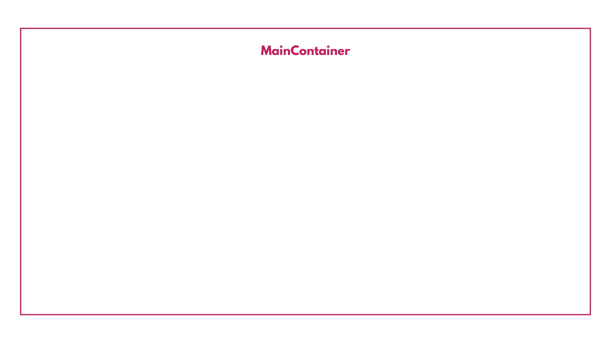
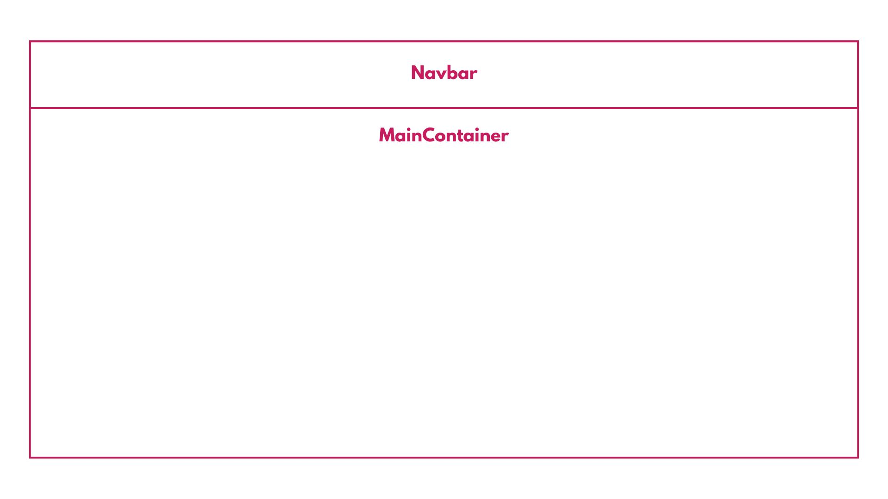

# V0 - Primera versión de Front-End

## Vistas

Para esta primera versión se implementaron las siguientes vistas:

* Inicio de sesión.
* Registro.
* Recuperación de contraseña.
* Visualización, creación, edición y eliminación de reportes.
* Visualización de detalle de reportes.
* Vista y edición de perfil.
* Creacion y edición de respuestas.

## Testing

Para esta versión no se implementaron pruebas de ningún tipo.

## Diseño responsive

Se implementó parcialmente el diseño responsive dado que no fue la prioridad de la versión.

## Estructura de los componentes

Se agrupó toda la estructura en un componente `Layout`; Las vistas se implementaban como hijo de este componente para ser visualizada dentro del `MainContainer`. Finalmente, es importante considerar que el  `LeftContainer` solo se visualiza cuando el usuario está logueado de forma segura.

Los mockups detallados se pueden ver en el siguiente documento:
[Mockups Front V0](./Documentacion/Mockups_Front_V0.pdf)

# V1 - Segunda versión de Front-End

## Vistas

Para esta segunda versión se implementaron las siguientes vistas:

* Inicio de sesión.
* Registro.
* Recuperación de contraseña.
* Visualización, creación, edición y eliminación de reportes.
* Visualización de detalle de reportes.
* Vista y edición de perfil.
* Creacion y edición de respuestas.
* Vista de módulo educativo.
* Muestra de notificaciones.
* Home para un usuario sin loguear y para un usuario logueado.

**Nota:** La mayoría de estas vistas coinciden en funcionalidad con las vistas de la primera versión, pero fueron rediseñadas completamente en cuánto al factor estético y visual.

## Testing

Para esta versión se implementaron tres pruebas que evalúan tres flujos principales:

* Primer flujo: Este flujo prueba que el usuario pueda iniciar sesión, posteriormente crea un reporte desde el home, y finalmente prueba la edición y eliminación del mismo.

* Segundo flujo: Este flujo prueba que el usuario pueda crear una respuesta a un reporte de mascota perdida, además prueba que se pueda editar y eliminar la respuesta.

* Tercer flujo: Este flujo prueba que el usuario pueda iniciar sesión, entrar a su perfil, visualizar y actualizar los datos de este.

Las pruebas se encuentran en el repositorio de integración del proyecto:
[Repositorio Pruebas de Integración](https://github.com/MascotasBogota/Test-Integracion.git)

## Diseño responsive

En esta versión ya se implementó un diseño responsivo para facilitar la visualización de la aplicación en otros dispositivo móviles.

## Estructura de los componentes

Esta versión cumple con dos tipos de esctructuras principales:

* Para las vistas correspondientes al inicio de sesión, registro y recuperación de contraseña, la vista se pasa directamente.

* Para las vistas correspondientes al home, visualización de reportes, creación de reportes, edición de perfil y módulo educativo, la estructura consiste en un componente `Layout`, dónde se juntan la navbar en la parte superior, y se pasa la vista cómo hijo del componente para mostrarse debajo de la navbar, además también junta el componente de notificaciones que se renderiza encima con un z-index mayor solamente cuando se abre dicha ventana. 

Los mockups detallados se pueden ver en los siguientes documentos:

- [Esquema Dimensiones Front V1](./Documentacion/Dimensiones_Iniciales_Front_V1.pdf)
- [Mockups Front V1](./Documentacion/Mockups_Iniciales_Front_V1.pdf)
